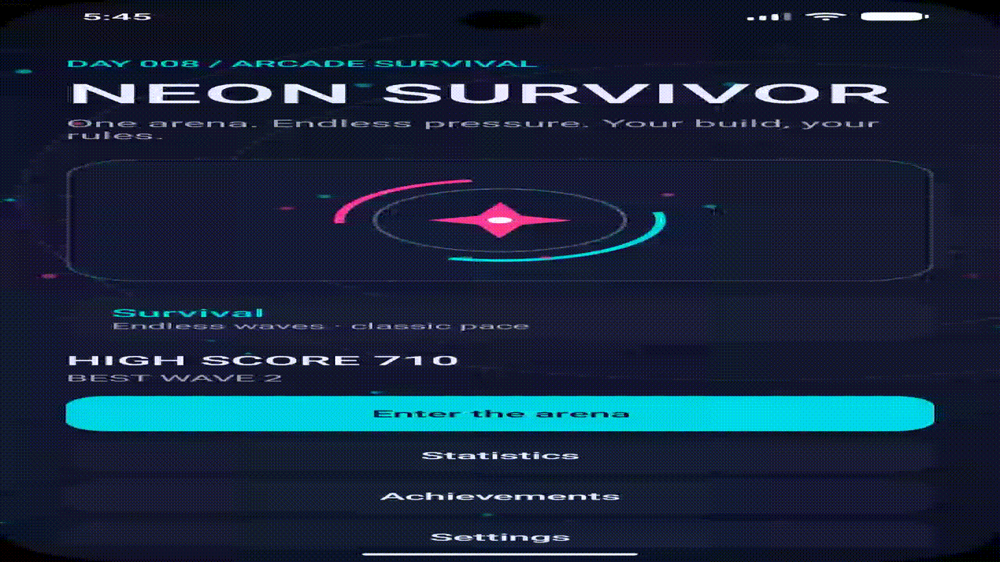
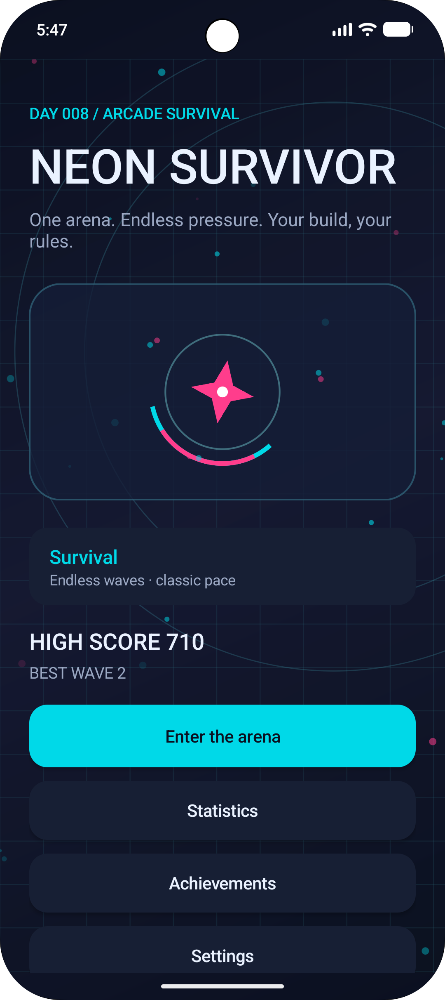
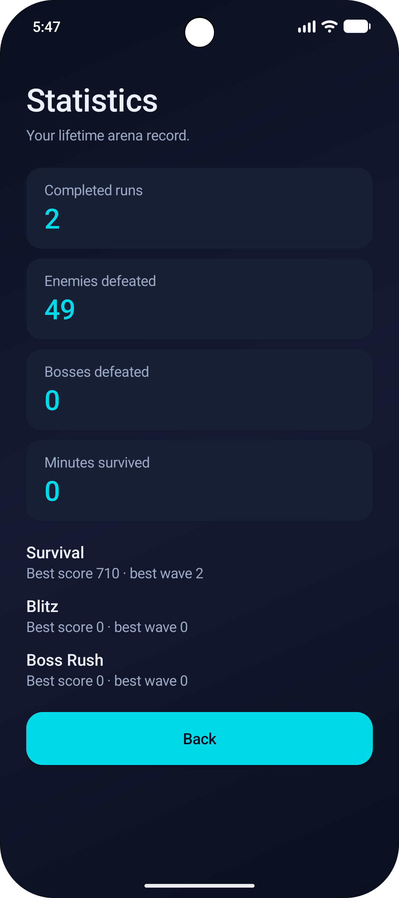
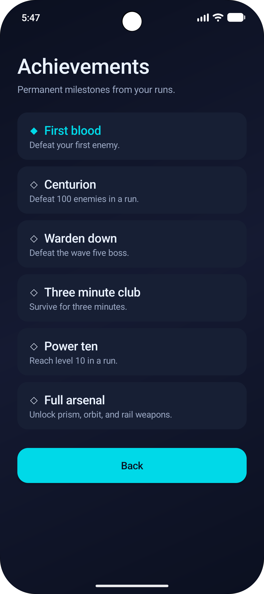
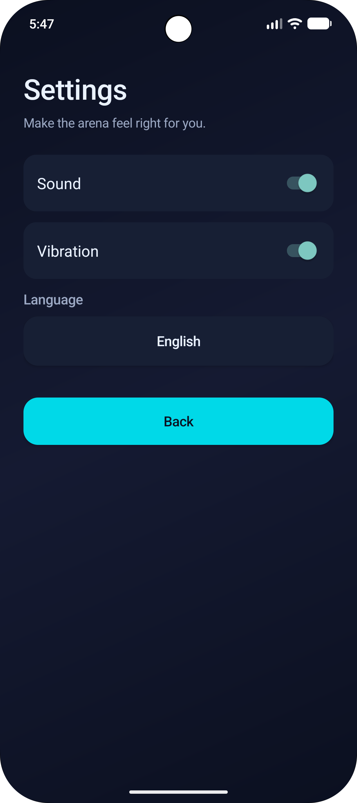

# Day 008 — Neon Survivor

## English

Neon Survivor is an offline Android arena survival game built in Kotlin. Drag anywhere to move; the main weapon automatically targets the nearest enemy. Tap **PULSE** at the lower right to clear nearby projectiles and damage surrounding enemies. Collect green XP crystals and choose one of three upgrades at each level; you may reroll the choices once per run.

### Features

- Native `SurfaceView`/Canvas renderer and frame-timed game loop.
- Four regular enemy classes: drone, dasher, tank, sniper; one boss with radial shots and a health bar.
- Contact damage, enemy projectiles, brief hit invulnerability, auto-targeted shots, XP pickups, levels and score.
- Eight upgrades: damage, fire rate, speed, max HP, prism spread, orbit blade, piercing rail shot and healing. Weapon upgrades stack up to three times.
- Three modes: Survival (endless 28-second waves; Warden on wave five), Blitz (90 seconds, faster waves, double score), and Boss Rush (boss every other wave, double score).
- Animated menu artwork, an active area Pulse with a 12-second cooldown, and one upgrade reroll per run.
- Pause, resume, restart, Game Over, per-mode high scores, lifetime statistics and six persistent achievements.
- Sound and vibration toggles; English, Kazakh and Russian UI. Settings and milestones are saved locally with Android `SharedPreferences`.
- Portrait UI scales to screen width, adjusts the arena to screen height, and respects status bar, camera cutout and navigation bar insets. Menus scroll on smaller screens. No account or network access is required.

### Open and build

1. Install a current Android Studio with Android SDK Platform 36 and Build Tools 36.0.0.
2. Open the **NeonSurvivor** folder, wait for Gradle sync, and select an emulator or Android device (Android 8.0 / API 26 or newer).
3. Click **Run**, or run `./gradlew :app:assembleDebug` (`gradlew.bat :app:assembleDebug` on Windows).
4. The debug APK appears at `app/build/outputs/apk/debug/app-debug.apk`. The project includes a development-only debug key so the APK can be generated consistently. Do not use that key for a store release.

### GitHub Release

1. Push this project to a GitHub repository. Keep `app/build/`, `.gradle/`, `local.properties` and release signing keys out of Git.
2. Build a release APK or AAB in Android Studio with **Build → Generate Signed App Bundle / APK** and your own release key. Store the key securely; it is required for future updates.
3. Create a version tag such as `v1.1.0` and a GitHub Release for that tag. Attach the signed APK (or the AAB if distributing through Google Play), add release notes and list Android 8.0+ as the requirement.

The included `app/debug.keystore` is only for local debug builds. The project ZIP contains source and Gradle wrapper files; generated build outputs are excluded.

## Қазақша

Neon Survivor — Kotlin тілінде жасалған интернетсіз жұмыс істейтін Android арена ойыны. Қозғалу үшін экранды сүйре; негізгі қару ең жақын жауға автоматты түрде атады. Төменгі оң жақтағы **ИМПУЛЬС** түймесі жақын жауларға соққы беріп, жау оқтарын жояды. Тәжірибе жинап, деңгей өскенде үш жақсартудың бірін таңда. Бір ойын ішінде ұсыныстарды бір рет ауыстыруға болады.

### Мүмкіндіктер

- `SurfaceView`/Canvas негізіндегі үздіксіз ойын циклі.
- Төрт кәдімгі жау түрі және оқ ататын басты жау.
- Соқтығысу, жау оғы, автоматты ату, тәжірибе, деңгей, ұпай және сегіз жақсарту.
- Үш режим: Аман қалу, 90 секундтық Блиц және басты жаулар режимі. Импульстің қайта дайындалу уақыты — 12 секунд.
- Қозғалмалы бас мәзір, кідіріс, қайта бастау, әр режимнің рекорды, жалпы статистика және сақталатын алты жетістік.
- Дыбыс пен дірілді баптау; қазақша, ағылшынша және орысша интерфейс. Нәтижелер мен баптаулар құрылғыда сақталады.

### Құрастыру

1. Android Studio, Android SDK Platform 36 және Build Tools 36.0.0 орнат.
2. **NeonSurvivor** бумасын ашып, Gradle синхрондауын күт. Android 8.0+ құрылғысын немесе эмуляторды таңда.
3. **Run** түймесін бас немесе `./gradlew :app:assembleDebug` пәрменін орында (Windows-та `gradlew.bat :app:assembleDebug`).
4. APK файлы `app/build/outputs/apk/debug/app-debug.apk` орнында болады.

### GitHub Release

Жобаны GitHub-қа жүкте. Android Studio-да **Build → Generate Signed App Bundle / APK** арқылы өзіңнің жеке кілтіңмен релизді қолтаңбала. `v1.1.0` сияқты тег жасап, GitHub Release жарияла да, қолтаңбаланған APK-ны тірке. Релиз кілтін қауіпсіз сақта; келесі жаңартуларға қажет. Жобаға қосылған debug кілтін жария релиз үшін қолданба.

## Русский

Neon Survivor — офлайн-игра для Android на Kotlin. Веди пальцем по экрану, чтобы двигаться; основное оружие автоматически стреляет в ближайшего врага. Нажми **ИМПУЛЬС** в правом нижнем углу, чтобы поразить ближайших врагов и уничтожить их снаряды. Собирай опыт и выбирай одно из трёх улучшений при повышении уровня. Один раз за забег варианты можно заменить.

### Возможности

- Непрерывный игровой цикл и нативная графика на `SurfaceView`/Canvas.
- Четыре типа обычных врагов и босс с круговой атакой и полосой здоровья.
- Столкновения, вражеские снаряды, автострельба, опыт, уровни, очки и восемь улучшений, включая три вида нового оружия.
- Три режима: Выживание (бесконечные волны, Страж на пятой), Блиц (90 секунд и двойные очки) и Охота на боссов (босс через волну).
- Анимированное главное меню, активная способность с перезарядкой 12 секунд и одна замена вариантов улучшений за забег.
- Пауза, перезапуск, отдельные рекорды по режимам, общая статистика и шесть постоянных достижений.
- Настройки звука и вибрации; английский, казахский и русский интерфейс. Результаты и настройки сохраняются на устройстве через `SharedPreferences`.
- Интерфейс учитывает статус-бар, вырез камеры и панель навигации; меню прокручиваются на небольших устройствах. Интернет и аккаунт не требуются.

### Как собрать APK

1. Установи актуальную Android Studio, Android SDK Platform 36 и Build Tools 36.0.0.
2. Открой папку **NeonSurvivor**, дождись синхронизации Gradle и выбери эмулятор или устройство с Android 8.0 / API 26 и новее.
3. Нажми **Run** или выполни `./gradlew :app:assembleDebug` (`gradlew.bat :app:assembleDebug` в Windows).
4. Готовый debug APK будет в `app/build/outputs/apk/debug/app-debug.apk`. В проекте есть только ключ для отладочной сборки; для публикации нужен свой ключ.

### Публикация GitHub Release

Загрузи проект в репозиторий GitHub. В Android Studio выбери **Build → Generate Signed App Bundle / APK** и подпиши релиз собственным ключом. Храни его надёжно: он понадобится для следующих обновлений. Создай тег, например `v1.1.0`, затем GitHub Release с заметками о версии и прикрепи подписанный APK. Укажи поддержку Android 8.0+.

ZIP содержит исходники и Gradle wrapper. Временные файлы сборки и debug APK исключены из архива.

---

## Gameplay video and screenshots

The recording shows the animated main menu and the game modes available before starting a run.

The main menu screenshot shows the selected Survival mode, personal high score, and entry points to gameplay, statistics, achievements, and settings.

The following screens document the app’s settings and saved run records:

| Screen | What it shows |
| --- | --- |
| `Screenshot_20260928_104740.png` | Statistics: completed runs, defeated enemies and bosses, time survived, and best results by mode. |
| `Screenshot_20260928_104748.png` | Achievements: unlocked and upcoming milestones, including enemy, boss, survival-time, level, and weapon goals. |
| `Screenshot_20260928_104755.png` | Settings: sound and vibration toggles, language selection, and navigation back to the game. |

